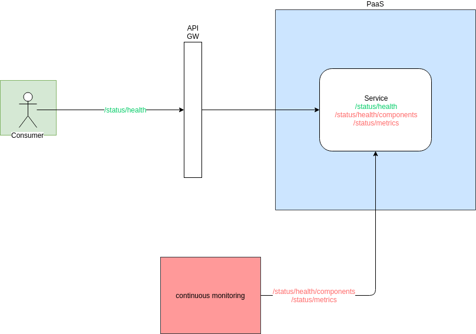

# Status endpoint
Dit document is een richtlijn naar inrichting van de health check endpoint ingebouwd op alle REST API's. 
Alle endpoints komen onder de resource `/status` terecht.

## Health
Deze endpoint beschrijft de werking van de service. Als deze niet werkende is zullen onderstaande niveaus worden gebruikt.

#### Status niveau's
Er zijn 3 verschillende niveaus van health status gedefinieerd.

status|verklaring
-------|-------
ok|de service werkt 
degraded|de service functioneert niet meer op 100% niet kritieke systemen zijn niet bereikbaar of de applicatie verwerkt trager requests
outage|ernstige problemen die er toe leiden dat de service niet meer werkt.

#### Basis response
Default zouden we deze status aanbieden naar afnemers toe, deze endpoint zou mee publiek ontsloten zijn op de API Gateway. Omdat consumers alleen geïnteresseerd zijn in of de service werkt.
```
/status/health
```
Response:
```
{
  "status": "degraded"
}
```
De afnemer van de service kan dan zelf de status pagina opvragen en naargelang de response acties ondernemen. (bv. een error pagina weergeven, bepaalde transacties bufferen, ...).

#### Status types

##### Ok

De applicatie heeft status ok. De applicatie zal correct werken.

##### Degraded

Bepaalde niet critische systemen zijn onbeschikbaar (bijvoorbeeld logging, limiet van DB connecties is bereikt).

##### Outage

De applicatie kan op dit moment  zijn primaire functie niet uitvoeren.

#### Components

Voor het continuous monitoring platform is er de components endpoint. Deze geeft een overzicht van alle afhankelijkheden en hun status. 
Dit endpoint is voorbehouden voor het continuous monitoring platform en zal niet worden ontsloten op de API Gateway.

```
/status/health/components
```
Voorbeeld response:
```
{
  "status": "outage",
  "components": [
    {
      "errormessage": "",
      "name": "database",
      "details": "database is working",
      "type": "db",
      "code":"",
      "status": "ok"
    },
    {
      "errormessage": "timeout",
      "name": "eventhandler",
      "details": "eventhandler timed out",
      "type": "event",
      "code":"TIMEOUT504",
      "status": "outage"
    }
  ]
}
```

## Metrics
Endpoint waar het continuous monitoring systeem metrics kan opvragen van de status.
```
/status/metrics
```
Default supported layout van prometheus is in plain formaat.

Flask metrics example:
```
process_virtual_memory_bytes 897339392.0
process_resident_memory_bytes 123064320.0
process_start_time_seconds 1530601590.11
process_cpu_seconds_total 2.8
process_open_fds 46.0
process_max_fds 1024.0
python_info{implementation="CPython",major="3",minor="6",patchlevel="5",version="3.6.5"} 1.0
flask_http_request_duration_seconds_bucket{le="0.005",method="GET",path="/favicon.ico",status="404"} 0.0
flask_http_request_duration_seconds_bucket{le="0.01",method="GET",path="/favicon.ico",status="404"} 0.0
flask_http_request_duration_seconds_bucket{le="0.025",method="GET",path="/favicon.ico",status="404"} 0.0
flask_http_request_duration_seconds_bucket{le="0.05",method="GET",path="/favicon.ico",status="404"} 0.0
flask_http_request_duration_seconds_bucket{le="0.075",method="GET",path="/favicon.ico",status="404"} 0.0
flask_http_request_duration_seconds_bucket{le="0.1",method="GET",path="/favicon.ico",status="404"} 0.0
flask_http_request_duration_seconds_bucket{le="0.25",method="GET",path="/favicon.ico",status="404"} 1.0
flask_http_request_duration_seconds_bucket{le="0.5",method="GET",path="/favicon.ico",status="404"} 1.0
flask_http_request_duration_seconds_bucket{le="0.75",method="GET",path="/favicon.ico",status="404"} 1.0
flask_http_request_duration_seconds_bucket{le="1.0",method="GET",path="/favicon.ico",status="404"} 1.0
flask_http_request_duration_seconds_bucket{le="2.5",method="GET",path="/favicon.ico",status="404"} 1.0
flask_http_request_duration_seconds_bucket{le="5.0",method="GET",path="/favicon.ico",status="404"} 1.0
flask_http_request_duration_seconds_bucket{le="7.5",method="GET",path="/favicon.ico",status="404"} 1.0
flask_http_request_duration_seconds_bucket{le="10.0",method="GET",path="/favicon.ico",status="404"} 1.0
flask_http_request_duration_seconds_bucket{le="+Inf",method="GET",path="/favicon.ico",status="404"} 1.0
flask_http_request_duration_seconds_count{method="GET",path="/favicon.ico",status="404"} 1.0
flask_http_request_duration_seconds_sum{method="GET",path="/favicon.ico",status="404"} 0.11943134200009808
flask_http_request_duration_seconds_bucket{le="0.005",method="POST",path="/uploads",status="202"} 0.0
flask_http_request_duration_seconds_bucket{le="0.01",method="POST",path="/uploads",status="202"} 0.0
flask_http_request_duration_seconds_bucket{le="0.025",method="POST",path="/uploads",status="202"} 0.0
flask_http_request_duration_seconds_bucket{le="0.05",method="POST",path="/uploads",status="202"} 1.0
flask_http_request_duration_seconds_bucket{le="0.075",method="POST",path="/uploads",status="202"} 1.0
flask_http_request_duration_seconds_bucket{le="0.1",method="POST",path="/uploads",status="202"} 1.0
flask_http_request_duration_seconds_bucket{le="0.25",method="POST",path="/uploads",status="202"} 1.0
flask_http_request_duration_seconds_bucket{le="0.5",method="POST",path="/uploads",status="202"} 1.0
flask_http_request_duration_seconds_bucket{le="0.75",method="POST",path="/uploads",status="202"} 1.0
flask_http_request_duration_seconds_bucket{le="1.0",method="POST",path="/uploads",status="202"} 1.0
flask_http_request_duration_seconds_bucket{le="2.5",method="POST",path="/uploads",status="202"} 1.0
flask_http_request_duration_seconds_bucket{le="5.0",method="POST",path="/uploads",status="202"} 1.0
flask_http_request_duration_seconds_bucket{le="7.5",method="POST",path="/uploads",status="202"} 1.0
flask_http_request_duration_seconds_bucket{le="10.0",method="POST",path="/uploads",status="202"} 1.0
flask_http_request_duration_seconds_bucket{le="+Inf",method="POST",path="/uploads",status="202"} 1.0
flask_http_request_duration_seconds_count{method="POST",path="/uploads",status="202"} 1.0
flask_http_request_duration_seconds_sum{method="POST",path="/uploads",status="202"} 0.03629215999990265
```

## Publicatie op API Gateway en security
Overzicht van endpoints en hun publicatie

endpoint				| 	Continuous Monitoring		|	Publicatie op GW	|	Gebruiker
-------------------------	|		----------------			|	----------------------	|	-----------------
`/status/system`				|							|					|	PaaS Systeem
`/status/health`				|							|		X			|	API GW
`/status/health/components`	|			X				|					|	Continuous Monitoring
`/status/metrics`			|			X				|		X			|	Continuous Monitoring

Overzicht:
 

## References

Spring default endpoints => https://docs.spring.io/spring-boot/docs/current/reference/html/production-ready-endpoints.html
Microsoft health endpoint monitoring => https://docs.microsoft.com/en-us/azure/architecture/patterns/health-endpoint-monitoring
Prometheus metric scraping: https://codeblog.dotsandbrackets.com/scraping-application-metrics-prometheus/
